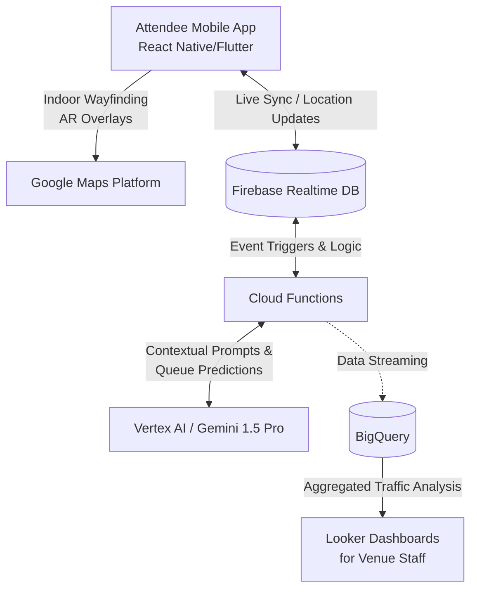

# Physical Event Experience Solution: System Design

This document outlines the System Architecture and Feature List for the "Frictionless Fan" Attendee Journey Optimization platform, aligned with the core requirements.

## 1. System Architecture

The architecture relies heavily on Google Cloud Platform (GCP) services acting together to form a highly scalable, real-time ecosystem capable of supporting 50,000+ concurrent stadium attendees.

### High-Level Architecture Diagram

### Component Modules

1. **Client Application (Frontend)**
   * **Stack:** React Native or Flutter.
   * **Role:** Serves as the user interface for attendees. Interacts with device hardware, consuming APIs for AR navigation and location permissions.

2. **Location & Routing Engine**
   * **Service:** Google Maps Platform (Advanced Indoor).
   * **Role:** Multi-floor stadium mapping. Acts as the core visual layer underneath routing mechanics, providing spatial awareness for generating paths.

3. **Real-time Synchronization Layer**
   * **Service:** Firebase Realtime Database & Cloud Functions.
   * **Role:** Stores and synchronizes the "Live Pulse" (e.g., player movements, crowd density markers, wait times). Cloud Functions trigger on DB writes to calculate and propagate status changes across all client instances with sub-second latency.

4. **Intelligence & Decision Engine**
   * **Service:** Gemini 1.5 Pro via Vertex AI.
   * **Role:** Serves as the Agentic Concierge. Receives metrics (e.g., game clock, queue lengths) via Cloud Functions and acts on them. Calculates the optimal "Time to Walk" considering dynamic obstacles and custom triggers.

5. **Big Data & Analytics**
   * **Service:** BigQuery and Looker.
   * **Role:** BigQuery swallows stream data from Firebase / Cloud Functions for historical and high-volume analysis. Looker visualizes this data for stadium operations teams to predict bottleneck surges.

---

## 2. Comprehensive Feature List

Based on the core mechanics identified in the Requirements, the application will provide the following distinct features targeted at "The Time-Poor Enthusiast".

### Feature 1: Predictive "Queue-Busting" & Virtual Queuing
* **Seamless Queue Joining:** Fans can browse concession and merchandise menus remotely and join a digital queue without leaving their seat.
* **Smart Concession Dispatcher:** Uses Gemini AI to understand the state of the game (e.g., approaching half-time) to meter the flow of upcoming orders.
* **"Time-to-Walk" Alerts:** Calculates the exact walking time from the attendee's specific seat to the pickup point and triggers a notification telling them *exactly* when to stand up so they arrive at the counter the moment the transaction completes.

### Feature 2: Dynamic "Heat-Mapped" Routing (AR-Nav)
* **Live Heatmaps:** Transforms the venue layout map into a dynamic heatmap displaying red/yellow/green congestion zones. 
* **Dynamic Recalculation:** Actively routes attendees away from choked corridors and over-populated restrooms.
* **AR-Core "Green Path":** For attendees utilizing their phone cameras in transit, the app overlays a visual, high-contrast, accessibility-friendly path on the floor to definitively guide them past obstacles (e.g., dense crowds, disabled escalators).

### Feature 3: "Squad-Sync" Real-Time Coordination
* **Private Venue Map Overlays:** Allows groups (squads) to form ad-hoc social clusters to share their real-time "Blue Dot" locations via Firebase's sub-second sync.
* **Adaptive Rendezvous Calculation:** Uses graph theory / spatial querying to calculate an optimal meeting location for multiple moving targets, deliberately avoiding high-heat/dense congestion areas.
* **Status Flags:** Let squad members flag "making a food run" so others can piggyback their orders collaboratively before checkout.

---

## 3. Deployment & Security Considerations
* **Authentication:** Handled seamlessly via Firebase Authentication (allowing Anonymous logins upgraded to OAuth for ordering).
* **Data Privacy:** User coordinate data must remain strictly ephemeral. Analytics data passing to BigQuery is hashed and stripped of Personally Identifiable Information (PII) to purely monitor crowd physics, not individual stalker-level tracking.
* **Scalability:** System defaults to Cloud Functions horizontally scaling to absorb the impact of extreme usage spikes (e.g., perfectly overlapping events like halftime beginnings).
